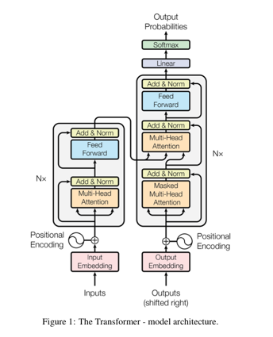

<h1 align="center">Attention Is All You Need <br>Transformer Implementation</h1>

참고 - [Transformers github](https://github.com/tunz/transformer-pytorch/blob/e7266679f0b32fd99135ea617213f986ceede056/model/transformer.py#L201)

## Model Architecture

<p align="center"></p>

### 1. Encoder

Encoder 는 N 개의 EncoderLayer 로 구성

입력으로 input data 와 pad_mask 를 받음

```python
class Encoder(nn.Module):
    def __init__(self, hidden_size, filter_size, dropout_rate, n_layers):
        super(Encoder, self).__init__()

        encoders = [EncoderLayer(hidden_size, filter_size, dropout_rate)
                    for _ in range(n_layers)]
        self.layers = nn.ModuleList(encoders)

        self.last_norm = nn.LayerNorm(hidden_size, eps=1e-6)

    def forward(self, inputs, mask):
        encoder_output = inputs
        for enc_layer in self.layers:
            encoder_output = enc_layer(encoder_output, mask)
        return self.last_norm(encoder_output)
```

EncoderLayer 는 2개의 sub module 로 구성

- Multi-Head Attention 
- Feed Forward Network

각각의 sub module 은 residual connection 과 LayerNormalization 을 통과

```python
class EncoderLayer(nn.Module):
    def __init__(self, hidden_size, filter_size, dropout_rate):
        super(EncoderLayer, self).__init__()

        self.self_attention_norm = nn.LayerNorm(hidden_size, eps=1e-6)
        self.self_attention = MultiHeadAttention(hidden_size, dropout_rate)
        self.self_attention_dropout = nn.Dropout(dropout_rate)

        self.ffn_norm = nn.LayerNorm(hidden_size, eps=1e-6)
        self.ffn = FeedForwardNetwork(hidden_size, filter_size, dropout_rate)
        self.ffn_dropout = nn.Dropout(dropout_rate)

    def forward(self, x, mask):
        y = self.self_attention_norm(x)
        y = self.self_attention(y, y, y, mask)
        y = self.self_attention_dropout(y)
        x = x + y

        y = self.ffn_norm(x)
        y = self.ffn(y)
        y = self.ffn_dropout(y)
        x = x + y
        return x
```

### 2. Multi-Head Attention

Multi-Head Attention 은 h 개의 Self-Attention 으로 구성

각각의 Self-Attention 은 Query, Key, Value 값을 받아 $W_Q, W_K, W_V$ 와 곱해서

Scaled Dot-Product Attention 진행해 Query 와 전체 문장 전체 토큰들의 Attention score 를 계산

$$Attention(Q, K, V) = softmax(\frac{QK^T}{\sqrt{d_k}})V$$

h 개의 Multi-Head Attention 을 하나로 합치고 $W_O$ 와 곱해서 Attention 정보 생성

```python
class MultiHeadAttention(nn.Module):
    def __init__(self, hidden_size, dropout_rate, head_size=8):
        super(MultiHeadAttention, self).__init__()

        self.head_size = head_size

        self.att_size = att_size = hidden_size // head_size
        self.scale = att_size ** -0.5

        self.linear_q = nn.Linear(hidden_size, head_size * att_size, bias=False)
        self.linear_k = nn.Linear(hidden_size, head_size * att_size, bias=False)
        self.linear_v = nn.Linear(hidden_size, head_size * att_size, bias=False)
        initialize_weight(self.linear_q)
        initialize_weight(self.linear_k)
        initialize_weight(self.linear_v)

        self.att_dropout = nn.Dropout(dropout_rate)

        self.output_layer = nn.Linear(head_size * att_size, hidden_size, bias=False)
        initialize_weight(self.output_layer)

    def forward(self, q, k, v, mask, cache=None):
        orig_q_size = q.size()

        d_k = self.att_size
        d_v = self.att_size
        batch_size = q.size(0)

        # head_i = Attention(Q(W^Q)_i, K(W^K)_i, V(W^V)_i)
        q = self.linear(q).view(batch_size, -1, self.head_size, d_k)  # [batch_size, q_len, head, d_k]
        if cache is not None and 'encdec_k' in cache:
            k, v = cache['encdec_k'], cache['encdec_v']
        else:
            k = self.linear_k(k).view(batch_size, -1, self.head_size, d_k)  # [batch_size, k_len, head, d_k]
            v = self.linear_v(v).view(batch_size, -1, self.head_size, d_v)  # [batch_size, v_len, head, d_k]

            if cache is not None:
                cache['encdec_k'], cache['encdec_v'] = k, v

        q = q.transpose(1, 2)  # [batch_size, head, q_len, d_k]
        v = v.transpose(1, 2)  # [batch_size, head, v_len, d_v]
        k = k.transpose(1, 2).transpose(2, 3)  # [batch_size, head, d_k, k_len]

        # Scaled Dot-Product Attention
        # Attention(Q, K, V) = softmax((QK^T)/sqrt(d_k))V
        q.mul_(self.scale)
        x = torch.matmul(q, k)  # [batch_size, head, q_len, k_len]
        x.masked_fill_(mask.unsqueeze(1), -1e9)
        x = torch.softmax(x, dim=3)
        x = self.att_dropout(x)
        x = x.matmul(v)  # [batch_size, head, q_len, d_v]

        x = x.transpose(1, 2).contiguous()  # [batch_size, q_len, head, d_v]
        x = x.view(batch_size, -1, self.head_size * d_v)  # [batch_size, q_len, hidden_size)

        x = self.output_layer(x)

        assert x.size() == orig_q_size
        return x
```

### 3. Feed Forward Network

Multi-Head Attention 을 통해 만들어진 Attention 정보를 Feed Forward Network 를 통과시켜

최종 Encoder output 을 생성

Feed Forward Network 는 2개의 linear layer 와 ReLU 로 구성

$$FFN(x) = max(0, xW_1 + b_1)W_2 + b_2$$

```python
class FeedForwardNetwork(nn.Module):
    def __init__(self, hidden_size, filter_size, dropout_rate):
        super(FeedForwardNetwork, self).__init__()

        self.layer1 = nn.Linear(hidden_size, filter_size)
        self.relu = nn.ReLU()
        self.dropout = nn.Dropout(dropout_rate)
        self.layer2 = nn.Linear(filter_size, hidden_size)

        initialize_weight(self.layer1)
        initialize_weight(self.layer2)

    def forward(self, x):
        x = self.layer1(x)
        x = self.relu(x)
        x = self.dropout(x)
        x = self.layer2(x)
        return x
```

### 4. Decoder

Decoder 도 Encoder 와 마찬가지로 N 개의 DecoderLayer 로 구성

Encoder 와 다른점은 입력으로 target data, Encoder output, input pad mask, target_self_mask 를 받음 

```python
class Decoder(nn.Module):
    def __init__(self, hidden_size, filter_size, dropout_rate, n_layers):
        super(Decoder, self).__init__()

        decoders = [DecoderLayer(hidden_size, filter_size, dropout_rate)
                    for _ in range(n_layers)]
        self.layers = nn.ModuleList(decoders)

        self.last_norm = nn.LayerNorm(hidden_size, eps=1e-6)

    def forward(self, targets, enc_output, i_mask, t_self_mask, cache):
        decoder_output = targets
        for i, dec_layer in enumerate(self.layers):
            layer_cache = None
            if cache is not None:
                if i not in cache:
                    cache[i] = {}
                layer_cache = cache[i]
            decoder_output = dec_layer(decoder_output, enc_output, t_self_mask, i_mask, layer_cache)
        return self.last_norm(decoder_output)
```

DecoderLayer 는 3개의 sub module 로 구성

- Masked Multi-Head Attention
- Multi-Head Attention
- Feed Forward Network

Encoder 와 거의 비슷하지만 Decoder 는 AutoRegressive 하게 다음 단어를 예측하므로 

Masked Multi-Head Attnetion 에서 현재 시점의 토큰 다음에 나오는 토큰들에 대해서 masking 을 해줌

Multi-Head Attention 에서는 Query 로는 target data 가 Masked Multi-Head Attention 을 통과한 Attention 정보를 사용하고
Key 와 Value 로는 Encoder output 을 사용

그 이후엔 Feed Forward Network 를 통과한 Decoder output 을 반환

```python
class DecoderLayer(nn.Module):
    def __init__(self, hidden_size, filter_size, dropout_rate):
        super(DecoderLayer, self).__init__()

        self.self_attention_norm = nn.LayerNorm(hidden_size, eps=1e-6)
        self.self_attention = MultiHeadAttention(hidden_size, dropout_rate)
        self.self_attention_dropout = nn.Dropout(dropout_rate)

        self.enc_dec_attention_norm = nn.LayerNorm(hidden_size, eps=1e-6)
        self.enc_dec_attention = MultiHeadAttention(hidden_size, dropout_rate)
        self.enc_dec_attention_dropout = nn.Dropout(dropout_rate)

        self.ffn_norm = nn.LayerNorm(hidden_size, eps=1e-6)
        self.ffn = FeedForwardNetwork(hidden_size, filter_size, dropout_rate)
        self.ffn_dropout = nn.Dropout(dropout_rate)

    def forward(self, x, enc_output, self_mask, i_mask, cache):
        y = self.self_attention_norm(x)
        y = self.self_attention(y, y, y, self_mask)
        y = self.self_attention_dropout(y)
        x = x + y

        if enc_output is not None:
            y = self.enc_dec_attention_norm(x)
            y = self.enc_dec_attention(y, enc_output, enc_output, i_mask, cache)
            y = self.enc_dec_attention_dropout(y)
            x = x + y

        y = self.ffn_norm(x)
        y = self.ffn(y)
        y = self.ffn_dropout(y)
        x = x + y
        return x
```

### 5. Transformer

최종 모델

Input data 를 Embedding layer 통과시켜 Embedding vector 를 얻고 
sequence 정보를 전달하기 위해 Positonal Encoding 값을 Embedding vector 와 더해서 
Encoder 에 입력으로 전달

Encoder 를 통과한 Encoder output 을 Decoder 에 전달해 target 과 input 의 Attention 정보를
활용해 Decoder output 을 생성

Decoder output 을 최종 linear layer 에 통과시켜 나온 logit 값을 
softmax 에 태워 다음에 나올 vocab 에서의 단어 확률을 반환

```python
class Transformer(nn.Module):
    def __init__(self, i_vocab_size, t_vocab_size,
                 n_layers=6,
                 hidden_size=512,
                 filter_size=2048,
                 dropout_rate=0.1,
                 share_target_embedding=True,
                 has_inputs=True,
                 src_pad_idx=None,
                 trg_pad_idx=None):
        super(Transformer, self).__init__()

        self.hidden_size = hidden_size
        self.emb_scale = hidden_size ** 0.5
        self.has_inputs = has_inputs
        self.src_pad_idx = src_pad_idx
        self.trg_pad_idx = trg_pad_idx

        self.t_vocab_embedding = nn.Embedding(t_vocab_size, hidden_size)
        nn.init.normal_(self.t_vocab_embedding.weight, mean=0,
                        std=hidden_size**-0.5)
        self.t_emb_dropout = nn.Dropout(dropout_rate)
        self.decoder = Decoder(hidden_size, filter_size, dropout_rate, n_layers)

        if has_inputs:
            if not share_target_embedding:
                self.i_vocab_embedding = nn.Embedding(i_vocab_size, hidden_size)
                nn.init.normal_(self.i_vocab_embedding.weight, mean=0,
                                std=hidden_size**-0.5)
            else:
                self.i_vocab_embedding = self.t_vocab_embedding

            self.i_emb_dropout = nn.Dropout(dropout_rate)

            self.encoder = Encoder(hidden_size, filter_size, dropout_rate, n_layers)

        # For positional encoding
        num_timescales = self.hidden_size // 2
        max_timescale = 10000.0
        min_timescale = 1.0
        log_timescale_increment = (
            math.log(float(max_timescale) / float(min_timescale)) / max(num_timescales - 1, 1)
        )
        inv_timescales = min_timescale * torch.exp(
            torch.arange(num_timescales, dtype=torch.float32) * -log_timescale_increment)
        self.register_buffer('inv_timescales', inv_timescales)

    def forward(self, inputs, targets):
        enc_output, i_mask = None, None
        if self.has_inputs:
            i_mask = utils.create_pad_mask(inputs, self.src_pad_idx)
            enc_output = self.encode(inputs, i_mask)

        t_mask = utils.create_pad_mask(targets, self.trg_pad_idx)
        target_size = targets.size()[1]
        t_self_mask = utils.create_trg_self_mask(target_size, device=targets.device)

        return self.decode(targets, enc_output, i_mask, t_self_mask, t_mask)

    def encode(self, inputs, i_mask):
        # Input embedding
        input_embedded = self.i_vocab_embedding(inputs)
        input_embedded.masked_fill_(i_mask.squeeze(1).unsqueeze(-1), 0)
        input_embedded *= self.emb_scale
        input_embedded += self.get_position_encoding(inputs)
        input_embedded = self.i_emb_dropout(input_embedded)

        return self.encoder(input_embedded, i_mask)

    def decode(self, targets, enc_output, i_mask, t_self_mask, t_mask, cache=None):
        # target embedding
        target_embedded = self.t_vocab_embedding(targets)
        target_embedded.masked_fill_(t_mask.squeeze(1).unsqueeze(-1), 0)

        # Shifting
        target_embedded = target_embedded[:, :-1]
        target_embedded = F.pad(target_embedded, (0, 0, 1, 0))

        target_embedded *= self.emb_scale
        target_embedded += self.get_position_encoding(targets)
        target_embedded = self.t_emb_dropout(target_embedded)

        # decoder
        decoder_output = self.decoder(target_embedded, enc_output, i_mask, t_self_mask, cache)

        # linear
        output = torch.matmul(decoder_output, self.t_vocab_embedding.weight.transpose(0, 1))

        return output

    def get_position_encdoing(self, x):
        # x : [batch_size, seq]
        max_length = x.size()[1]
        position = torch.arange(max_length, dtype=torch.float32, device=x.device)
        scaled_time = position.unsqueeze(1) * self.inv_timescales.unsqueeze(0)
        signal = torch.cat([torch.sin(scaled_time), torch.cos(scaled_time)], dim=1)
        signal = F.pad(signal, (0, 0, 0, self.hidden_size % 2))
        signal = signal.view(1, max_length, self.hidden_size)
        return signal
```

이상으로 Transformer 를 간단하게 코드로 정리해보았다.

데이터를 구해서 영어-한국어 번역 학습 과정을 만드는 것도 생각해봐야겠다.
